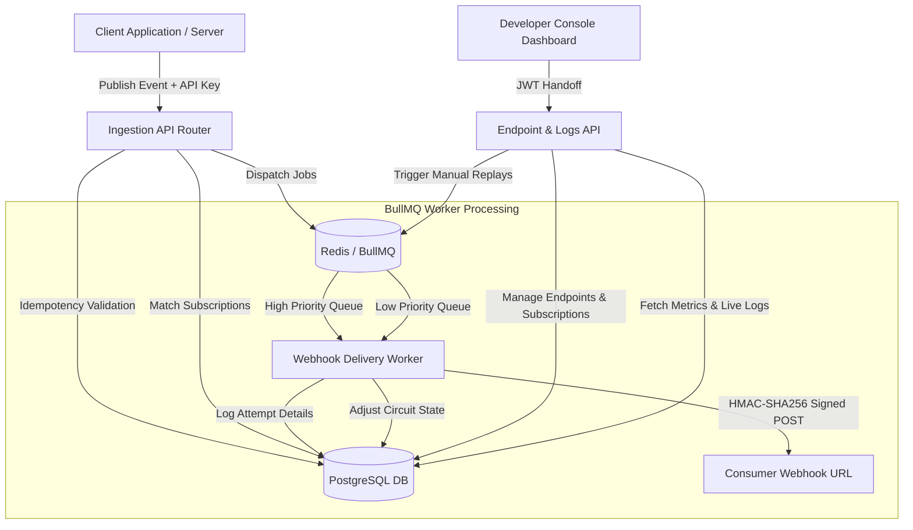

# Reliable Webhook Management Engine & Developer Console

A highly scalable, secure, and resilient asynchronous event delivery platform built to send real-time webhooks with enterprise-grade reliability. This project implements production-ready SDE design patterns: security verifications, rate limiting, circuit breakers, event versioning, idempotency, and developer observability.

---

## 🏗️ Architecture Design



---

## 🛠️ Tech Stack
- **Backend API & Workflows**: Node.js, TypeScript, Express, Prisma ORM, BullMQ (Redis), Zod, JWT.
- **Frontend Dashboard**: React, Vite, TypeScript, Tailwind CSS, Recharts.
- **Databases**: PostgreSQL (Relational metadata & delivery logs) + Redis (State store for background queues).

---

## 🚀 Getting Started

### 📋 Prerequisites
You will need to have the following installed on your machine:
- **Node.js** (v18 or higher)
- **NPM** (v9 or higher)
- **Docker & Docker Compose** (to run database services)

### 💻 Local Setup

1. **Clone the Repository**:
   ```bash
   git clone <your-repo-url>
   cd webhook-system
   ```

2. **Start Infrastructure Services**:
   Spin up PostgreSQL and Redis using Docker Compose:
   ```bash
   docker-compose -f infra/docker-compose.yml up -d
   ```

3. **Install Dependencies**:
   Install all dependencies for backend, frontend, and root workspaces:
   ```bash
   npm install
   ```

4. **Environment Configuration**:
   Create a `.env` file in the `backend` folder (pre-configured values are in [backend/.env](file:///c:/Users/SRI%20DEVI/OneDrive/Desktop/webhook/backend/.env)):
   ```bash
   cp backend/.env.example backend/.env
   ```

5. **Run Database Migrations & Client Generation**:
   Sync your database schema and compile Prisma Client:
   ```bash
   npm run prisma:migrate --workspace=backend
   npm run prisma:generate --workspace=backend
   ```

6. **Start the Development Servers**:
   Run both the API server and the frontend console concurrently:
   - **Backend Server**: `npm run backend:dev`
   - **Background Worker**: `npm run worker --workspace=backend`
   - **Frontend Console**: `npm run frontend:dev`

---

## ⚙️ Core SDE Design Implementations
1. **User Session Authentication**: Multi-level token handlers using short-lived JWT Access Tokens, Cookie refresh token rotation, and distinct REST API keys (`whkey_...`).
2. **SSRF Safe Target Validation**: Restricts webhook URLs targeting `localhost`, loopback addresses, private IP ranges (RFC 1918), and forces `HTTPS` to prevent server-side request forgery.
3. **Queue Distribution & Priortization**: Built using BullMQ and Redis, routing payments to `high-priority` queues and other metrics to `low-priority` lines.
4. **Endpoint Ownership Verification**: Performs challenge-response testing, firing a `GET` challenge query before activating custom webhooks.
5. **Backoffs, Jitter & Circuit Breakers**: Retries failures using exponential scaling with random noise. Opens circuit connections to persistently failing receivers to prevent system congestion.
